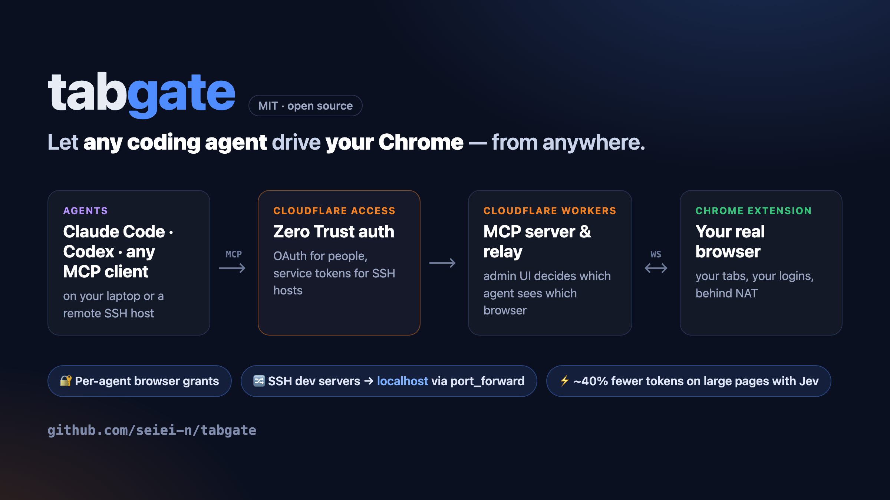

# tabgate



[English](README.md) | 日本語

どのコーディングハーネス（Claude Code / Codex / Cursor など MCP クライアント）からでも、手元の Chrome を操作できるようにするブリッジです。
Cloudflare Workers を中継点にし、Cloudflare Access（Zero Trust）で認証します。SSH 先のエージェントなど NAT の内側からも使えます。

```
[エージェント (SSH 先など)] --MCP/HTTP--> [Cloudflare Access] --> [Worker /mcp] ─┐
[管理者のブラウザ] --------------------> [Cloudflare Access] --> [Worker / , /api] ├─ Durable Object "Hub"
[Chrome 拡張機能] ------WebSocket------> (Access Bypass)    --> [Worker /ext] ──┘   (ブラウザ・権限・中継)
```

- `extension/`: Chrome 拡張機能（MV3）。Worker に WebSocket で常時接続し、`chrome.debugger`（CDP）でタブを操作する
- `worker/`: Cloudflare Worker + Durable Object。MCP サーバー（Streamable HTTP）、拡張機能の中継、管理画面を 1 つにまとめている

## 権限モデル

- **ブラウザ**: 管理画面で登録するとトークンが発行される。拡張機能はトークンで接続する
- **エージェント**: Access が付けた ID で識別する（ユーザーならメール、Service Token なら `svc:<Client ID>`）
- **権限付与**: 管理画面で「エージェント × ブラウザ」をチェックする。既定では何も見えない
- 手元の拡張機能ポップアップの「接続を許可する」を外すと、即座に切断できる

## MCP ツール

`list_browsers` `list_tabs` `open_tab` `navigate` `close_tab` `screenshot` `read_page` `find` `port_forward` `click` `type` `evaluate` `cdp`

許可されたブラウザが 1 台だけなら `browser` 引数は省略できます。

`read_page` は本文を返し、操作できる要素の位置に印を埋め込みます。印の番号は `[data-tg="N"]` として `click` / `type` に渡せます。表の行・リスト項目・見出しは 1 行にまとまります。

```
alice@example.com Alice [53:select-one member] [54]保存 最終ログイン 2026/06/29 … [56]招待を再送 [57]停止 [58]削除
```

- `[N]ラベル`: リンク・ボタンなど
- `[N:type 値]`: 入力欄（値が空ならプレースホルダー）

## SSH 先の開発サーバーをブラウザで開く（任意・macOS）

SSH 先のエージェントが `localhost:5173` などで動かしている開発サーバーを、手元の Chrome で開いて操作できます。ブラウザ側の PC から `ssh -L` でポート転送を張るので、SSH 先にも Cloudflare にも追加の設定は要りません。

### 設定（ブラウザ側の Mac で 1 回）

```sh
./native/install.sh <拡張機能 ID>     # ID は chrome://extensions の tabgate に表示される
echo devbox >> ~/.config/tabgate/forward-hosts   # 転送を許可する SSH ホスト（~/.ssh/config の名前）
```

前提: その Mac からパスワードなしで `ssh <ホスト>` できること。

### 使い方（エージェント）

1. `port_forward` `{ "action": "list" }` で、転送できるホストを確認
2. `port_forward` `{ "action": "open", "host": "devbox", "port": 5173 }` で転送を張る
3. `open_tab` で `http://localhost:5173` を開き、あとは通常どおり `read_page` / `click` など
4. 終わったら `port_forward` `{ "action": "close", ... }`

### 仕組みと制限

- 拡張機能から Chrome の native messaging で `native/tabgate-forward.py` を起動し、`ssh -f -N -L 127.0.0.1:<port>:localhost:<port> <host>` を実行する
- 転送できるのは `~/.config/tabgate/forward-hosts` に書いたホストだけ。ポートは 1024〜65535 の整数だけ受け付け、Mac の `127.0.0.1` にだけ開く（LAN からは見えない）
- ブラウザ側とSSH 先で同じポート番号を使う。Mac 側でそのポートが使用中なら `open` は失敗する
- 使えるのは native host を入れた PC の Chrome だけ
- 入力検証のテスト: `python3 native/test_forward.py`

## Jev でトークンを節約する（任意）

[TypeSafe](https://typesafe.ai) の Jev を使うと、ページ全体をエージェントに渡さず、拡張機能の中で必要な部分だけを選んで返せます。

### 設定

1. [console.typesafe.ai](https://console.typesafe.ai/keys) で API キーを発行する
2. 拡張機能のポップアップの「Jev API キー」に入れて保存する

キーは拡張機能の中（`chrome.storage.local`）にだけ保存され、Worker やエージェントには渡りません。Jev の呼び出しも拡張機能から直接行います。

### 使えるようになるもの

| ツール | 渡すもの | 返るもの |
|---|---|---|
| `find` | `query`: 探す要素（例: `login button`）、`top_k`（既定 5） | 候補の selector・要素ラベル・確率 `p`、該当がありそうかの確率 `exists` |
| `read_page` + `query` | `query`: 知りたいこと（例: `price of the product`）、`top_k`（既定 3） | 関連する節だけと、関連があるかの確率 `relevant` |

`find` が返した `selector` はそのまま `click` / `type` に渡せます。

```jsonc
// find { "tabId": 123, "query": "delete button for alice@example.com" }
{
  "exists": 0.9,
  "candidates": [
    { "selector": "[data-tg=\"58\"]", "element": "<button type=submit> 削除 @ alice@example.com Alice member 保存 最終ログイン…", "p": 0.99 }
  ]
}
```

### エージェント向けの使い方

- 大きいページ（全文が数万字）では `find` / `read_page` + `query` で絞り込む。小さいページは全文の `read_page` 1 回の方が安い（下の実測を参照）
- `query` は英語で書く（Jev は英語の方が精度が高い）
- 削除などの取り消せない操作の前は、候補の `element`（`@` 以降に行の内容が付く）で対象を確かめる

実測（OAuth クライアント 22 件の管理画面）:

- 1 回で返る量: 全文の `read_page` 4,635 字（要素の印を本文に埋め込む前は 8,234 字）に対し、`find` 155〜224 字、`read_page` + `query` 604 字。1 回あたり約 0.45 秒（Worker・拡張機能・Jev の往復込み）
- タスク全体（Claude Code で同じ読み取りタスクを Jev あり・なしで 3 回ずつ）: この大きさのページでは Jev で合計トークンは減らなかった。エージェントがツールを 1 回多く呼ぶと、会話全体（約 1.6 万トークン）を送り直す分の方が、全文を読まずに済んだ分より大きいため

実測（英語版 Wikipedia「Tokyo」、全文の `read_page` が 3 万字で打ち切られる大きさ）:

- タスク全体の入力トークン: Jev なし 27,245 に対し、Jev あり 15,900〜16,700（約 40% 減）。情報を読むタスクと要素の selector を探すタスクの両方で同程度。全 18 回とも正解
- エージェントは指示しなくても、大きいページでは `read_page` に `query` を付けて呼んだ

### 仕組み

- 要素一覧や本文の節に ID を振って Jev に渡し、「どれが合うか（Choice）」と「そもそも該当があるか（Noul）」を 1 リクエストで同時に聞く
- 要素が 250 件を超えたら 250 件ずつ並列に選ばせ、各組の上位で決勝を行う（Choice の選択肢は最大 255 件のため）
- 同じ表記の要素（行ごとの「削除」ボタンなど）には、属する行・見出しのテキストを添えて区別できるようにしている
- 本文は表の行・リスト項目・見出しを 1 行にまとめてから約 500 字の節に分ける
- 確率 0.05 未満の候補は返さない（最低 1 件は返す）

### 注意

- `find` と `read_page` + `query` を使うと、ページの要素一覧と本文が TypeSafe の API に送られる。社外に出したくないページでは使わない（キーを空にすれば送られない）
- キーが未設定のとき、`find` はエラーを返し、`read_page` は `query` を無視して全文を返す
- `find` が見る要素は 500 件まで、`read_page` + `query` が見る本文は先頭 2 万字まで（Jev の入力上限 32k tokens に収めるため）

## ローカル（LAN）で使う

```sh
cd worker
pnpm install
cat > .dev.vars <<'EOF'
ACCESS_TEAM_DOMAIN=
LOCAL_ADMIN_TOKEN=管理画面用の長いランダム文字列
LOCAL_AGENT_TOKENS=laptop=エージェント用の長いランダム文字列,server=別のトークン
EOF
pnpm dev               # 0.0.0.0:8787 で待ち受け
```

`ACCESS_TEAM_DOMAIN` が空のときはローカルモードになり、Bearer トークンで認証します（`.dev.vars` で `wrangler.jsonc` の本番設定を上書きしている）。

- `LOCAL_ADMIN_TOKEN`: 管理画面・管理 API 用。エージェントには渡さない
- `LOCAL_AGENT_TOKENS`: エージェント用（`名前=トークン` のカンマ区切り）。エージェントは `local:<名前>` として識別され、許可されたブラウザだけが見える

1. `http://<IP>:8787/` を開き、LOCAL_ADMIN_TOKEN を入力してブラウザを登録 → トークンをコピー
2. `chrome://extensions` →「パッケージ化されていない拡張機能を読み込む」で `extension/` を読み込む
3. 拡張機能のポップアップにサーバー URL とトークンを入れ、「許可する」にチェックして保存
4. エージェントに登録:

```sh
claude mcp add --transport http tabgate http://<IP>:8787/mcp --header "Authorization: Bearer <エージェント用トークン>"
```

5. 管理画面でエージェント `local:<名前>` にブラウザを許可

## Cloudflare にデプロイしてリモートから使う

```sh
cd worker
pnpm run deploy
```

カスタムドメイン（例: `tabgate.example.com`）を Worker に割り当てたうえで、Zero Trust ダッシュボードで以下を設定します。

1. **Access アプリ（本体）**: self-hosted、ドメイン `tabgate.example.com`
   - ポリシー: 使う人のメールアドレス / グループを Allow
   - SSH 先などブラウザを開けない環境向けに、Service Token を作り **Service Auth** ポリシーも追加
   - Advanced settings → **Managed OAuth** をオン（MCP クライアントが OAuth でログインできるようになる）
   - 表示される **Application Audience (AUD) Tag** を控える
2. **Access アプリ（拡張機能用）**: self-hosted、ドメイン `tabgate.example.com`、パス `/ext`、ポリシーは **Bypass**
   （拡張機能は WebSocket の hello でブラウザトークンを送り、Worker が検証する）
3. `wrangler.jsonc` の `vars` を設定して再デプロイ:
   - `ACCESS_TEAM_DOMAIN`: `https://<team>.cloudflareaccess.com`
   - `ACCESS_AUD`: 1 で控えた AUD
   - `ADMIN_EMAILS`: 管理画面を使える人のメール

エージェントからの接続:

```sh
# ブラウザでログインできる環境（Managed OAuth）
claude mcp add --transport http tabgate https://tabgate.example.com/mcp

# SSH 先など（Service Token）
claude mcp add --transport http tabgate https://tabgate.example.com/mcp \
  --header "CF-Access-Client-Id: <id>" --header "CF-Access-Client-Secret: <secret>"
```

最初の接続でエージェントが管理画面に現れるので、見せたいブラウザにチェックを入れます。

## テスト

```sh
cd worker && pnpm test  # wrangler dev を起動し、偽の拡張機能 + MCP クライアントで一通り確認
```

## 既知の制限

- `screenshot` はバックグラウンドのタブだとタイムアウトすることがある
- 操作中のタブには Chrome の「デバッグ中」バーが出る（`chrome.debugger` の仕様）
- MCP は JSON 応答のみ（SSE ストリーミングやサーバー発の通知は未対応）
- 中継は Durable Object 1 インスタンス。個人〜小規模チーム向け

## ライセンス

[MIT](LICENSE)
